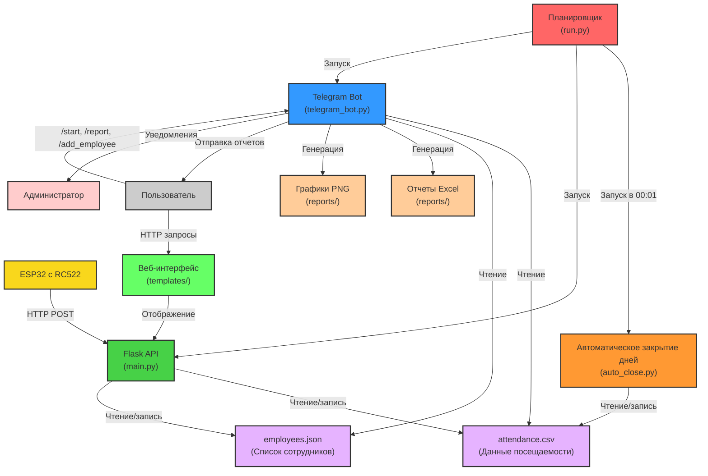

# Архитектура системы СКУД на Python

## Общая схема



## Компоненты системы

### 1. ESP32 с RC522 (Аппаратная часть)
- **Файл**: `RFID_RC522_Tracker_Python/RFID_RC522_Tracker_Python.ino`
- **Функциональность**:
  - Считывание RFID-карт через RC522 (13.56 МГц)
  - Получение текущего времени через NTP
  - Отправка данных на Flask API через HTTP POST
  - Светодиодная индикация состояния (зеленый/красный)
  - Поддержка двух WiFi сетей (основная/резервная)
  - Локальный режим для отладки

### 2. Flask API и веб-интерфейс (Серверная часть)
- **Файл**: `app/main.py`
- **API endpoints**:
  - `POST /api/attendance` - регистрация посещения от ESP32
  - `GET /api/health` - проверка работоспособности
- **Веб-интерфейс**:
  - `GET /` → `/dashboard` - панель управления
  - `GET /attendance` - просмотр посещаемости с фильтрами
  - `GET /employees` - управление сотрудниками
  - `GET /reports` - генерация и просмотр отчетов
  - `POST /add_employee` - добавление сотрудника
  - `POST /edit_employee` - редактирование сотрудника
  - `GET /download_report/<filename>` - скачивание отчетов

### 3. Telegram Bot (Интерфейс пользователя)
- **Файл**: `app/telegram_bot.py`
- **Команды**:
  - `/start` - приветствие и меню
  - `/report` - получение отчета за месяц
  - `/add_employee <serial> <name>` - добавление сотрудника
  - `/webapp` - открытие веб-приложения
- **Функциональность**:
  - Генерация Excel-отчетов с детальной статистикой
  - Создание графиков посещаемости (matplotlib/seaborn)
  - Отправка уведомлений администратору
  - Контроль доступа по ID пользователей
  - Поддержка Telegram Web App

### 4. Автоматическое закрытие дней
- **Файл**: `app/auto_close.py`
- **Функциональность**:
  - Запуск каждый день в 00:01
  - Поиск записей с приходом, но без ухода
  - Автоматическое заполнение времени ухода (17:00)
  - Логирование выполненных операций

### 5. Планировщик (Координатор системы)
- **Файл**: `run.py`
- **Функциональность**:
  - Запуск Flask API в отдельном процессе
  - Запуск Telegram бота в отдельном процессе
  - Планирование автоматического закрытия дней
  - Обработка ошибок и корректное завершение
  - Логирование системных событий

## Логика определения прихода/ухода

### Алгоритм обработки сканирования карты

```python
def record_attendance():
    # 1. Получение данных от ESP32
    serial = data['serial']
    timestamp = data['time']
    
    # 2. Проверка существования сотрудника
    if serial not in employees:
        # Уведомление администратору о неизвестной карте
        return "unknown"
    
    # 3. Поиск записи за текущий день
    mask = (df['date'] == date_str) & (df['employee'] == employee_name)
    
    if mask.any():
        # Запись существует
        if pd.isna(row['arrival']):
            # Записываем приход
            event_type = 'приход'
        elif pd.isna(row['departure']):
            # Записываем уход
            event_type = 'уход'
        else:
            # Перезаписываем уход
            event_type = 'уход (повтор)'
    else:
        # Создаем новую запись - всегда приход
        event_type = 'приход'
    
    # 4. Сохранение данных и уведомление
    save_attendance_data(df)
    notify_admin(f"{employee_name}: {event_type} в {time_str}")
```

### Состояния записи посещаемости

```
Состояние 1: arrival=null, departure=null
Сканирование → arrival=09:00, departure=null (ПРИХОД)

Состояние 2: arrival=09:00, departure=null  
Сканирование → arrival=09:00, departure=17:30 (УХОД)

Состояние 3: arrival=09:00, departure=17:30
Сканирование → arrival=09:00, departure=18:00 (УХОД повтор)
```

## Хранение данных

### 1. Данные посещаемости (attendance.csv)
```csv
date,employee,arrival,departure
2025-07-06,Поляков,09:15,17:30
2025-07-06,Тарасов,08:45,18:00
2025-07-07,Поляков,09:05,
```

**Особенности**:
- Одна запись на сотрудника на день
- Пустое departure означает незакрытый день
- Автозакрытие в 00:01 устанавливает departure=17:00

### 2. Список сотрудников (employees.json)
```json
{
  "992BEE97": "Поляков",
  "894046B8": "Тарасов",
  "E9DBA5A3": "Шура"
}
```

**Особенности**:
- Ключ - серийный номер карты (HEX, uppercase)
- Значение - имя сотрудника
- Динамическое добавление через бота или веб-интерфейс

### 3. Отчеты (data/reports/)
- **Excel файлы**: `attendance_report_YYYY_MM_MonthName.xlsx`
  - Лист "Сводный отчет" - статистика по сотрудникам
  - Лист "Детальный отчет" - все записи за месяц
- **Графики**: `chart_YYYY_MM.png` - визуализация отработанных часов

## Потоки данных

### 1. Регистрация посещения
```
ESP32 → HTTP POST /api/attendance → Flask API → 
attendance.csv + employees.json → Telegram уведомление
```

### 2. Генерация отчета через бота
```
Telegram /report → telegram_bot.py → attendance.csv → 
Excel + PNG → Отправка пользователю
```

### 3. Веб-интерфейс
```
Браузер → Flask routes → attendance.csv + employees.json → 
HTML templates → Отображение данных
```

### 4. Автоматическое закрытие дней
```
Планировщик (00:01) → auto_close.py → attendance.csv → 
Поиск незакрытых записей → Установка departure=17:00
```

## Безопасность и контроль доступа

### 1. Telegram Bot
- **ALLOWED_USERS** - список ID пользователей с доступом
- **ADMIN_USER_ID** - ID для получения уведомлений
- Проверка прав доступа в каждой команде

### 2. Веб-интерфейс
- Локальный доступ (localhost:5000)
- Нет встроенной аутентификации (предполагается локальная сеть)

### 3. API
- Открытый доступ для ESP32
- Валидация входных данных
- Логирование всех запросов

## Масштабирование и развитие

### Возможные улучшения

1. **База данных**:
   - Замена CSV на SQLite/PostgreSQL
   - Индексы для быстрого поиска
   - Транзакции для целостности данных

2. **Безопасность**:
   - Аутентификация в веб-интерфейсе
   - API ключи для ESP32
   - HTTPS для защищенной передачи

3. **Функциональность**:
   - Временные ограничения на сканирование
   - Защита от случайных сканирований
   - История всех сканирований (не только последнего)
   - Интеграция с внешними системами

4. **Мониторинг**:
   - Метрики производительности
   - Алерты при сбоях
   - Дашборд для администратора

### Архитектурные решения

- **Модульность**: каждый компонент может работать независимо
- **Отказоустойчивость**: система продолжает работать при сбое одного компонента
- **Простота**: минимальные зависимости и понятная структура
- **Расширяемость**: легко добавлять новые функции и интеграции

## Технические требования

### Минимальные требования
- Python 3.8+
- 100 МБ свободного места
- 512 МБ RAM
- Сетевое подключение для ESP32 и Telegram

### Рекомендуемые требования
- Python 3.10+
- 1 ГБ свободного места
- 2 ГБ RAM
- SSD для быстрого доступа к данным
- Стабильное интернет-соединение
