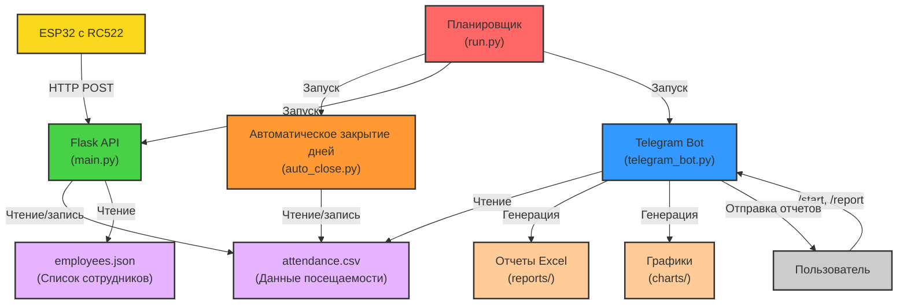

# Архитектура системы СКУД на Python

## Общая схема



## Компоненты системы

### 1. ESP32 с RC522
- **Роль**: Считывание RFID-карт и отправка данных на сервер
- **Файл**: `RFID_RC522_Tracker_Python.ino`
- **Функциональность**:
  - Считывание RFID-карт через RC522
  - Получение текущего времени через NTP
  - Отправка данных на Flask API через HTTP POST
  - Индикация состояния через светодиоды

### 2. Flask API
- **Роль**: Обработка запросов от ESP32 и запись данных посещаемости
- **Файл**: `app/main.py`
- **Функциональность**:
  - Прием HTTP POST запросов с данными карт
  - Идентификация сотрудников по ID карты
  - Запись времени прихода/ухода
  - Обработка повторных отметок
  - Предоставление API для проверки работоспособности

### 3. Telegram Bot
- **Роль**: Интерфейс для получения отчетов
- **Файл**: `app/telegram_bot.py`
- **Функциональность**:
  - Обработка команд от пользователей
  - Генерация отчетов в формате Excel
  - Создание графиков посещаемости
  - Отправка отчетов пользователям
  - Контроль доступа по ID пользователей

### 4. Автоматическое закрытие дней
- **Роль**: Закрытие незавершенных дней
- **Файл**: `app/auto_close.py`
- **Функциональность**:
  - Поиск записей с приходом, но без ухода
  - Автоматическое заполнение времени ухода
  - Логирование выполненных операций

### 5. Планировщик
- **Роль**: Запуск и координация всех компонентов
- **Файл**: `run.py`
- **Функциональность**:
  - Запуск Flask API
  - Запуск Telegram бота
  - Планирование запуска автоматического закрытия дней
  - Обработка ошибок и завершение работы

## Хранение данных

### 1. Данные посещаемости
- **Файл**: `data/attendance.csv`
- **Структура**:
  ```
  date,employee,arrival,departure
  2023-07-01,Иванов,09:15,17:30
  ```

### 2. Список сотрудников
- **Файл**: `data/employees.json`
- **Структура**:
  ```json
  {
    "992BEE97": "Поляков",
    "894046B8": "Тарасов"
  }
  ```

### 3. Отчеты
- **Директория**: `data/reports/`
- **Типы файлов**:
  - Excel-файлы с отчетами посещаемости
  - PNG-файлы с графиками

## Потоки данных

1. **Регистрация посещения**:
   - ESP32 считывает RFID-карту
   - Отправляет ID карты и время на Flask API
   - API идентифицирует сотрудника и записывает данные
   - Возвращает результат на ESP32

2. **Генерация отчета**:
   - Пользователь отправляет команду `/report` боту
   - Бот читает данные из `attendance.csv`
   - Генерирует Excel-файл и график
   - Отправляет файлы пользователю

3. **Автоматическое закрытие дней**:
   - Планировщик запускает скрипт в 00:01
   - Скрипт находит незавершенные записи за вчерашний день
   - Заполняет время ухода значением по умолчанию
   - Сохраняет обновленные данные

## Безопасность

1. **Контроль доступа к боту**:
   - Доступ только для авторизованных пользователей по ID
   - Логирование попыток несанкционированного доступа

2. **Защита данных**:
   - Локальное хранение данных без внешнего доступа
   - Возможность резервного копирования

## Масштабирование

Система спроектирована с возможностью масштабирования:

1. **Замена хранилища данных**:
   - Возможность замены CSV на SQL базу данных
   - Модульная архитектура позволяет легко заменить компоненты

2. **Добавление функциональности**:
   - Новые команды для бота
   - Дополнительные типы отчетов
   - Интеграция с другими системами 