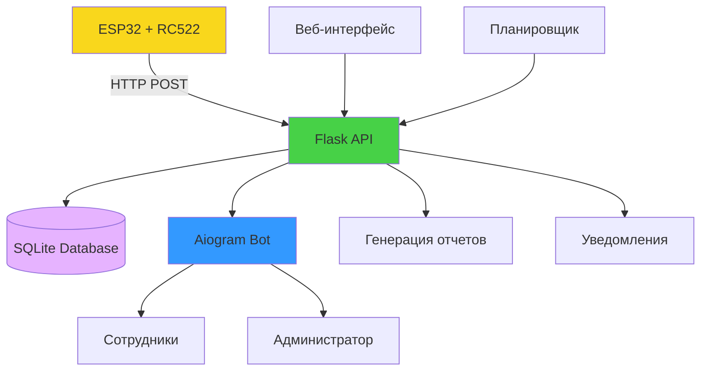

# СКУД Enhanced - Система контроля и учета доступа

🚀 **Улучшенная версия системы СКУД с современной архитектурой и расширенным функционалом**

## ✨ Основные улучшения в версии 2.0

### 🔧 Технические улучшения
- **Aiogram 3.x** вместо python-telegram-bot для более быстрой работы
- **SQLAlchemy + SQLite** вместо CSV/JSON файлов 
- **Async/await** архитектура для лучшей производительности
- **Pydantic** валидация данных
- **JWT токены** для безопасной регистрации
- **Loguru** для продвинутого логирования

### 🆕 Новый функционал
- **Регистрация сотрудников через ссылки** - администратор может отправить ссылку для самостоятельной регистрации
- **Уведомления сотрудникам** - каждый сотрудник получает уведомления о своих приходах/уходах
- **Детальная история** - сохранение всех событий с метаданными
- **Настройки уведомлений** - каждый сотрудник может настроить типы уведомлений
- **Роли пользователей** - администраторы, сотрудники, наблюдатели
- **Автоочистка данных** - автоматическое удаление старых запросов
- **Системный мониторинг** - детальное логирование и статистика

### 📊 Улучшенная отчетность
- **Интерактивные графики** с Plotly
- **Экспорт в Excel** с форматированием
- **Недельные отчеты** и статистика
- **Веб-дашборд** в реальном времени
- **API для интеграций**

## 🏗️ Архитектура системы



## 📋 Требования

- **Python 3.9+**
- **ESP32** с RFID-считывателем RC522
- **Telegram Bot Token**
- **50+ МБ свободного места**

## 🚀 Быстрый старт

### 1. Установка

```bash
# Клонирование проекта
git clone <repository-url>
cd SKUD_Enhanced

# Установка зависимостей
pip install -r requirements.txt
```

### 2. Настройка

```bash
# Копируем файл конфигурации
cp env.example .env

# Редактируем настройки
nano .env
```

**Минимально необходимые настройки:**
```env
TELEGRAM_BOT_TOKEN=your_bot_token_here
TELEGRAM_ADMIN_ID=your_telegram_id_here
```

### 3. Запуск

```bash
# Полный запуск (рекомендуется)
python run.py

# Или только веб-сервер
python run.py flask

# Или только Telegram бот
python run.py bot
```

### 4. Первоначальная настройка

1. Откройте http://localhost:5000
2. В Telegram напишите боту `/start`
3. Добавьте первые карты через веб-интерфейс или бота

## 🔧 Конфигурация ESP32

### Схема подключения RC522

```
┌─────────────┬─────────────────┐
│ RC522       │ ESP32-C3        │
├─────────────┼─────────────────┤
│ SDA (SS)    │ GPIO6 (D4)      │
│ SCK         │ GPIO8 (D8)      │
│ MOSI        │ GPIO10 (D10)    │
│ MISO        │ GPIO9 (D9)      │
│ GND         │ GND             │
│ RST         │ GPIO7 (D5)      │
│ 3.3V        │ 3V3             │
└─────────────┴─────────────────┘
```

### Настройка кода ESP32

В файле Arduino скетча измените:

```cpp
// WiFi настройки
const char* ssid = "your_wifi_name";
const char* password = "your_wifi_password";

// URL сервера СКУД
const char* serverURL = "http://your_server_ip:5000/api/attendance";

// API ключ (опционально)
const char* apiKey = "your_api_key";
```

## 💳 Управление сотрудниками

### Через Telegram бота

```
/start - Главное меню
/add_employee SERIAL_NUMBER Имя Сотрудника - Добавить сотрудника
/report - Получить отчет
```

### Через веб-интерфейс

1. Откройте http://localhost:5000/employees
2. Нажмите "Добавить сотрудника"
3. Заполните данные

### Регистрация через ссылку

1. При сканировании неизвестной карты администратор получает уведомление
2. Выбираете "Создать ссылку для регистрации"
3. Отправляете ссылку сотруднику
4. Сотрудник заполняет форму и привязывает карту

## 🔔 Система уведомлений

### Типы уведомлений

- **Администратору**: все события, неизвестные карты, системные уведомления
- **Сотрудникам**: персональные уведомления о приходах/уходах

### Настройка уведомлений

В Telegram боте:
1. Нажмите "⚙️ Настройки"
2. Включите/отключите нужные типы уведомлений

### Пример уведомления сотруднику

```
🟢 Приход на работу

Добро пожаловать на работу, Иван Иванов!

⏰ Время: 09:15
📅 Дата: 20.01.2025
💳 Карта: ABC123DEF
```

## 📊 Отчеты и аналитика

### Доступные отчеты

- **Месячные отчеты** - детальная статистика за месяц
- **Недельные отчеты** - краткая сводка за неделю  
- **Индивидуальные отчеты** - по конкретному сотруднику
- **Экспорт в Excel** - с графиками и форматированием

### Получение отчетов

**Через Telegram:**
```
/report - Выбор периода
```

**Через веб-интерфейс:**
1. Откройте http://localhost:5000/reports
2. Выберите период и тип отчета
3. Скачайте готовый файл

### Автоматические отчеты

- Ежемесячные отчеты генерируются автоматически
- Отправка администратору в Telegram
- Сохранение в папке `data/reports/`

## 🔒 Безопасность

### Уровни доступа

- **Администратор** - полный доступ ко всем функциям
- **Сотрудник** - просмотр своих данных, настройка уведомлений  
- **Наблюдатель** - только просмотр отчетов

### Защита API

- API ключи для ESP32
- JWT токены для регистрационных ссылок
- Валидация всех входных данных
- Логирование всех действий

### Приватность данных

- Локальное хранение всех данных
- Шифрование чувствительных данных
- Автоочистка временных данных

## 🛠️ API

### Основные endpoint'ы

```http
POST /api/attendance
GET  /api/health
GET  /api/employees
GET  /api/current-stats
```

### Пример запроса от ESP32

```json
POST /api/attendance
{
  "serial": "ABC123DEF",
  "time": "2025-01-20 14:30:00",
  "api_key": "your_api_key"
}
```

### Пример ответа

```json
{
  "status": "success",
  "message": "Записано: Иван Иванов - приход в 14:30",
  "data": {
    "employee": "Иван Иванов",
    "event": "arrival",
    "time": "14:30",
    "date": "2025-01-20"
  }
}
```

## 📁 Структура проекта

```
SKUD_Enhanced/
├── app/                    # Основное приложение
│   ├── services/          # Бизнес-логика
│   ├── models.py          # Модели базы данных
│   ├── database.py        # Управление БД
│   ├── config.py          # Конфигурация
│   ├── main.py           # Flask приложение
│   └── telegram_bot.py   # Aiogram бот
├── data/                  # Данные и отчеты
│   ├── skud.db           # База данных SQLite
│   └── reports/          # Генерируемые отчеты
├── templates/            # HTML шаблоны
├── static/              # CSS, JS, изображения
├── logs/               # Файлы логов
├── run.py             # Главный файл запуска
├── requirements.txt   # Зависимости Python
└── README.md         # Документация
```

## 🔄 Автоматизация

### Планировщик задач

- **00:01** - Автозакрытие незавершенных дней
- **Каждый час** - Очистка просроченных регистраций
- **Ежедневно** - Резервное копирование данных

### Автозакрытие дней

Если сотрудник забыл "отметиться" на выходе, система автоматически закрывает день в 17:00.

## 🐛 Диагностика и решение проблем

### Логи системы

```bash
# Просмотр логов в реальном времени
tail -f logs/skud.log

# Поиск ошибок
grep ERROR logs/skud.log
```

### Частые проблемы

**Бот не отвечает:**
```bash
# Проверьте токен и ID администратора
grep TELEGRAM .env
```

**ESP32 не может подключиться:**
- Проверьте IP адрес сервера
- Убедитесь, что порт 5000 открыт
- Проверьте API ключ

**База данных заблокирована:**
```bash
# Перезапуск системы
python run.py
```

### Резервное копирование

```bash
# Создание резервной копии
cp data/skud.db data/backup_$(date +%Y%m%d).db

# Восстановление
cp data/backup_20250120.db data/skud.db
```

## 🔮 Планы развития

### В ближайших версиях

- [ ] **Мобильное приложение** - React Native / Flutter
- [ ] **Интеграция с 1С** - обмен данными
- [ ] **Биометрия** - поддержка отпечатков пальцев
- [ ] **Геолокация** - контроль местоположения при отметках
- [ ] **Push-уведомления** - через Firebase
- [ ] **Многотенантность** - поддержка нескольких организаций

### Интеграции

- **Slack** - уведомления в корпоративный чат
- **Google Calendar** - синхронизация с календарем
- **HR системы** - обмен данными о сотрудниках
- **Системы безопасности** - интеграция с СКУД оборудованием

## 👥 Поддержка

### Документация

- [Полная документация](./DOCS.md)
- [API Reference](./API.md)
- [Troubleshooting](./TROUBLESHOOTING.md)

### Сообщество

- 📧 Email: support@skud-enhanced.ru
- 💬 Telegram: @skud_support
- 🐛 Issues: GitHub Issues

## 📄 Лицензия

MIT License - см. файл [LICENSE](LICENSE)

---

**🎯 СКУД Enhanced - современная система учета рабочего времени для вашего бизнеса**

*Создано с ❤️ для эффективного управления персоналом* 